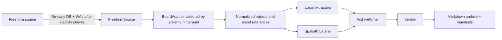

# Architecture

## Data flow

## Components

### FreeformSource

Discovers a local Freeform data container and validates permissions. It compares database/WAL file
signatures before and after copying the database and any present WAL, retries when they change, and
opens only the copied SQLite database in read-only/query-only mode. It never opens the live SQLite
database. Asset reads are restricted to regular, non-symlink files inside Freeform's Assets
directory. Source metadata exposed to the archive is sanitized and excludes absolute developer
paths.

### BoardAdapter

Parses a recognized schema into normalized objects, asset references, bounds, explicit parents,
and text. Adapter selection uses `user_version`, required table columns, and a structural
fingerprint rather than an assumed macOS version. An unrecognized but structurally compatible v16
fingerprint is disabled by default and requires explicit experimental opt-in; incompatible
versions or structures fail closed.

### AssetExtractor

Preserves each distinct original by SHA-256 and creates optional searchable derivatives:

- Apple Vision performs image and scanned-page OCR locally on macOS.
- PDF text is extracted locally; pages without a text layer may use OCR.
- UTF-8 text, Markdown, CSV, JSON, and HTML files receive direct local text extraction.
- Audio and video receive basic metadata, richer local metadata through `ffprobe` when available,
  or WAV metadata through Python's standard library. Version 0.1 does not transcribe them.

Extractor failures do not discard the original. They create warnings or unresolved records.

### SpatialClusterer

Produces deterministic Scene candidates from bounds, parent groups, overlap, and distance. When
geometry is absent, it falls back to explicit parent groups and stable object order.
Spatial clustering suggests context; it does not invent an event or factual relationship.
The relation pass separately records explicit parent membership, observed overlap, reciprocal
nearest-neighbour proximity, and low-confidence unique-nearest comment candidates with evidence
and reason fields.

### ArchiveWriter

Creates safe relative paths, stores canonical originals, emits searchable sidecars and Scene files,
and writes archive-schema 1.0 manifests. Hash-equal assets share one canonical original and retain
all source references through `duplicate-of` relationships.

### Verifier

Checks required archive files, allowed object dispositions, canonical object paths, asset and
relation references, duplicate targets, orphan originals/extractions, original hashes, checksum
entries, internal Markdown links, absolute user paths and recognized credential patterns in
ordinary generated text, and unresolved objects. Accepted unresolved objects are counted
separately. Verification is deterministic and produces both a machine-readable report and a
non-zero exit status on failure.

## Refinement model

`archive` creates a complete baseline before semantic review. `refine` consumes an editable
`scene-map.yml` containing labels, membership changes, and reasoned acceptance of known unresolved
objects. It rewrites Scene indexes, object Scene values and text canonical paths, recalculates
spatial relations, retains duplicate-asset relations, refreshes checksums, and runs verification.
It never rewrites originals, so a reviewer can improve event grouping without duplicating files.

## Trust boundaries

- The Freeform source is untrusted, private input.
- SQLite values, CRDT payloads, filenames, links, and embedded documents are untrusted.
- Archive paths are resolved beneath one explicit output root.
- Generated ordinary text is filtered, but original attachments retain their source sensitivity.
- Optional agent review operates on the exported archive and visual baseline; the deterministic
  CLI remains independently usable and testable.

## Extension points

New compatibility belongs in a `BoardAdapter` supported by synthetic fixtures and golden output.
New extractors implement the normalized extractor interface without changing object identity.
Archive-schema extensions must remain additive within 1.x or introduce a documented migration.
